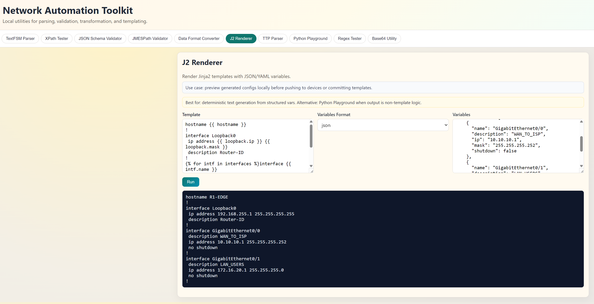

# Network Automation Toolkit

A fast, local-first web toolkit for network engineers to parse, validate, transform, and test data in one place.

Built for day-to-day workflows like CLI parsing, XML/JSON querying, template rendering, and quick Python experimentation.

## Why This Project

When you are troubleshooting automation logic, you often need multiple tools open at once: parser playgrounds, JSON query testers, schema validators, and quick Python scratchpads. This project brings those utilities into a single local app with practical defaults and ready-to-run examples.

## Feature Set

- `TextFSM Parser` for structured extraction from CLI output
- `XPath Tester` for XML/NETCONF queries
- `JSON Schema Validator` for payload contract checks
- `JMESPath Validator` for JSON filtering and selection
- `Data Format Converter` (`JSON <-> XML <-> YAML`)
- `Data Model Workbench` to infer JSON Schema/Pydantic models and validate payloads
- `J2 Renderer` (Jinja2 template rendering)
- `TTP Parser` for semi-structured text parsing
- `Python Playground` with session state and terminal-style prompt
- `Regex Tester`
- `Base64 Utility`
- Theme selector with `Sand`, `Solarized`, `Light`, and `Dark` palettes (saved in browser)

## Python Playground Highlights

- Interactive session with persistent state
- Variables available in session:
  - `value` (alias of `var1`)
  - `var1`, `var2`, `var3`
- `Check Vars` detects type and warns when input falls back to plain string
- `Code Pad` for multiline blocks (functions, loops, imports)
- Prompt for quick one-liners
- `Load Code Pad`, `Clear Screen`, and session controls

## Data Model Workbench Highlights

- Generate a first-pass model from real sample payloads (`json_schema` or `pydantic`)
- Validate new payloads against inferred schema before they reach automation code
- Catch data drift early (missing fields, type mismatches, structural changes)
- Speed up model design when integrating new APIs, telemetry, or inventory sources

## Quick Start

```bash
python3 -m venv .venv
source .venv/bin/activate
pip install -r requirements.txt
./app.py
```

Open: `http://127.0.0.1:5000`

Optional debug mode:

```bash
FLASK_DEBUG=1 ./app.py
```

## Screenshots

### Overview



### Python Playground


### Regex Tester


### J2 Renderer


### Data Format Converter


## Project Structure

```text
.
├── app.py
├── docs/
│   └── images/
├── requirements.txt
├── static/
│   ├── app.js
│   └── style.css
└── templates/
    └── index.html
```

## Security Notes

- Python Playground executes Python code locally in your app process.
- Use only trusted input and run on your own machine/network.
- This project is intended for local development and lab workflows.

## Contributing

Issues and PRs are welcome.

Please read [CONTRIBUTING.md](./CONTRIBUTING.md) before opening a PR.

Issue templates are included for:
- Bug reports
- Feature requests

## Acknowledgment

Built with the help of AI to move faster, iterate smarter, and deliver a better developer experience.

Inspired by tools and workflows from Nebula by Packet Coders:
https://nebula.packetcoders.io/textfsm-parser/

## Roadmap Ideas

- Import/export saved sessions and snippets
- More converters (CSV, TOML)
- Diff view for rendered templates
- Plugin-style custom tools

## License

This project is licensed under the MIT License. See [LICENSE](./LICENSE).
